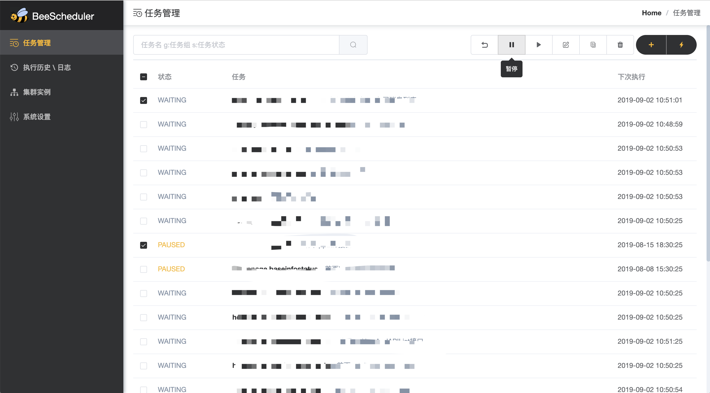
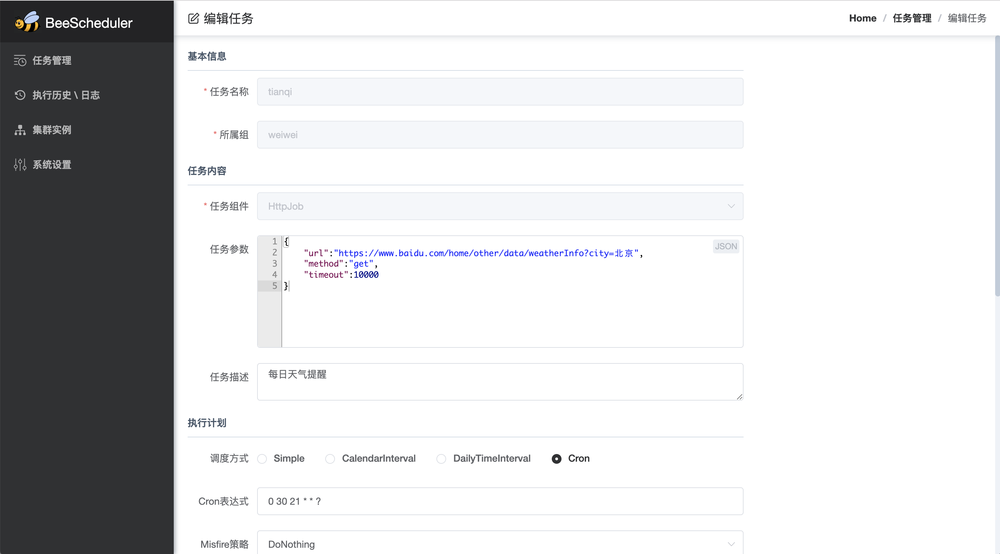
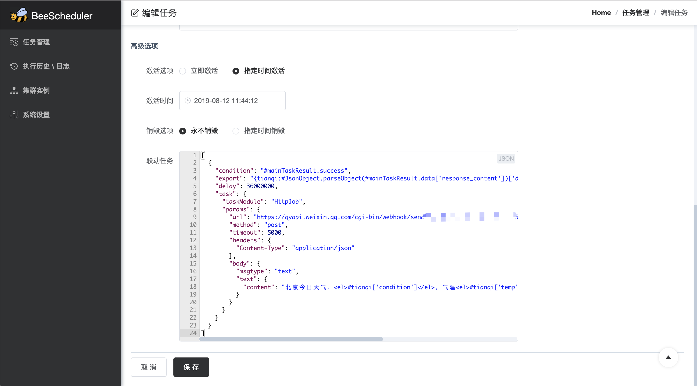
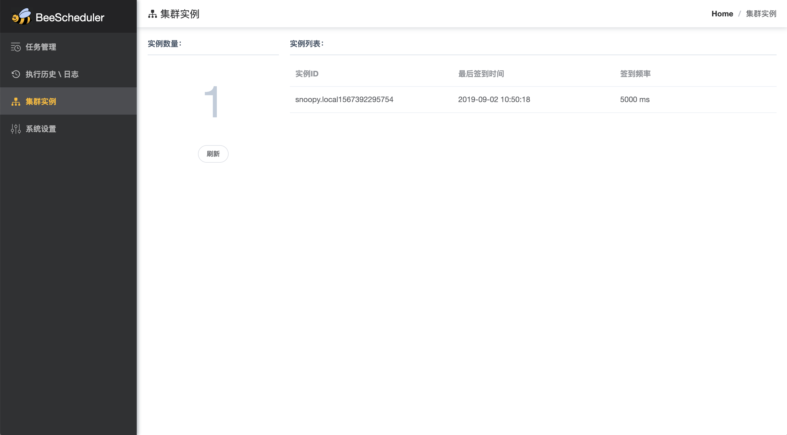
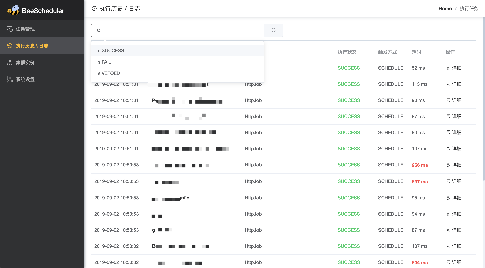
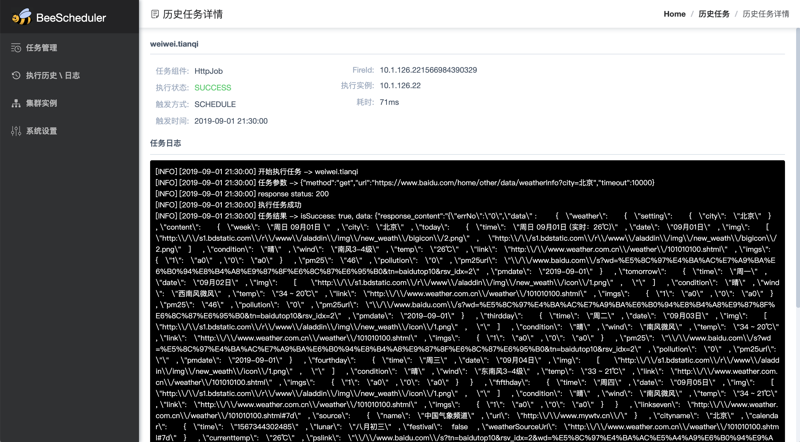

# Bee-Scheduler
  
### 特性
- 通过任务组件的方式，将调度逻辑与任务逻辑完全隔离，代码零侵入，灵活性极高
- 支持集群和单机两种运行模式，轻松扩展
- 丰富的任务组件：http、mail、dubbo、kafka、shell、sql。。。另外，合理的组件抽象设计使得开发一个组件非常简单，后续会提供更多组件
- 提供丰富的定时器（simple、calendar、daily、cron）
- 强大的任务管理（编辑、暂停、恢复调度、立即运行、复制任务、删除等等）
- 支持联动任务，直接页面操作来配置出任何你想要的联动规则
- 详细的任务历史记录（执行时间、执行节点、耗时、日志、状态、触发方式等等。。。）
- 支持临时任务，一键执行一次性任务
- 支持多数据库：MySQL、PostgreSQL

### 环境要求
- java要求1.8以上的版本
- Mysql或PostgreSQL数据库，用于存储任务数据
  
### 如何使用
创建一个数据库用于存储任务数据（库名随意、UTF-8字符集），比如下文中的bee-scheduler就是库名  
至此，所有准备工作就已经完成！  
  
>“不用建表吗（黑人问号脸.jpg）？？？”  
>“不用！数据表会在系统首次启动的时候自动生成”
  
### 单机运行模式
#### 运行管理节点: console-node
```shell
java -jar bee-scheduler-consolenode-xxx.jar --server.port=8080 --dburl="jdbc:mysql://127.0.0.1:3306/bee-scheduler?user=root&password=root&characterEncoding=UTF-8&useSSL=false&serverTimezone=Asia/Shanghai"
```
启动完成后浏览器访问：http://ip:port  ，默认账号admin/admin ，请使用IE9+、Chrome、Safari、Firefox等现代浏览器  
  
### 集群运行模式：
#### 1、运行管理节点:console-node，并使用--cluster参数开启集群：
```shell
java -jar bee-scheduler-consolenode-xxx.jar --server.port=8080 --dburl="jdbc:mysql://127.0.0.1:3306/bee-scheduler?user=root&password=root&characterEncoding=UTF-8&useSSL=false&serverTimezone=Asia/Shanghai" --cluster
```
启动完成后浏览器访问管理节点：http://ip:port ，默认账号admin/admin  
 **（注意：管理节点本身也是一个调度节点，参与任务执行）**，请使用IE9+、Chrome、Safari、Firefox等现代浏览器 

#### 2、运行扩展节点:daemon-node
```shell
java -jar bee-scheduler-daemonnode-xxx.jar --dburl="jdbc:mysql://127.0.0.1:3306/bee-scheduler?user=root&password=root&characterEncoding=UTF-8&useSSL=false&serverTimezone=Asia/Shanghai"
```
启动完成后，访问管理节点能看到集群信息
>扩展节点的数量可以随时增减，新增的节点启动完成后，会自动加入集群，停止的扩展节点会自动退出集群

#### 3、启动参数
|参数名|类型|是否必须|含义|默认值|
|:-|:-|:-|:-|:-|
|--dburl|int|是|指定数据库连接串| - |
|--server.port|int|管理节点必须|指定管理后台http端口号| - |
|--thread-pool-size|int|否|用于并发执行任务的线程数,建议最大不要超过100|10|
|--instance-id|string|否|实例ID|AUTO(自动生成)|
|--cluster| - |否|是否开启集群模式|无需参数值|

**（注意：v2.5.2及以上的版本支持postgre数据库，dburl参数中需要指定前缀如：jdbc:mysql://、jdbc:postgresql://）**

### 管理界面截图







  
### 开源协议
[MIT](http://opensource.org/licenses/MIT)