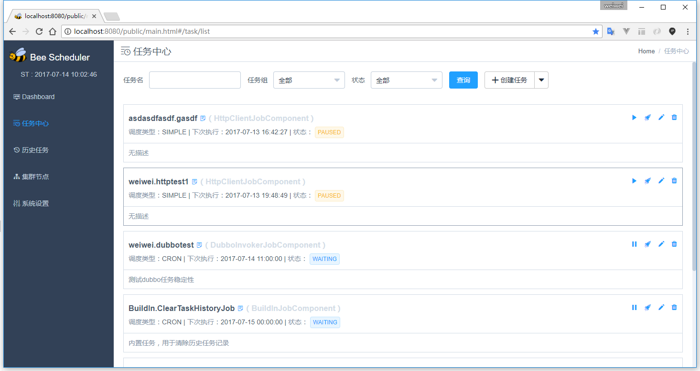
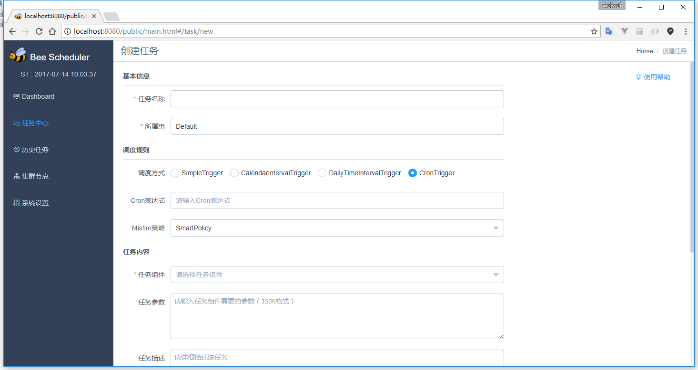
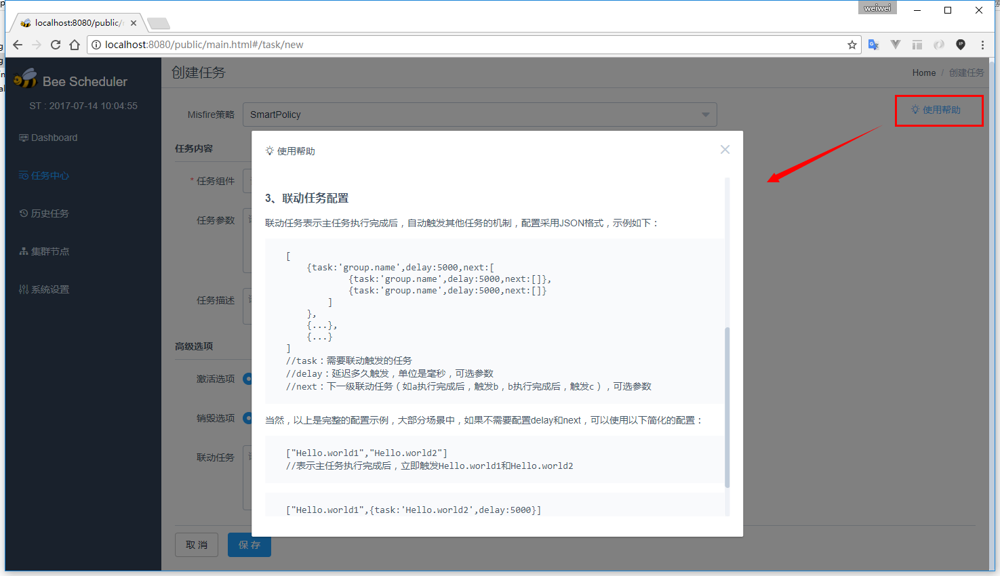
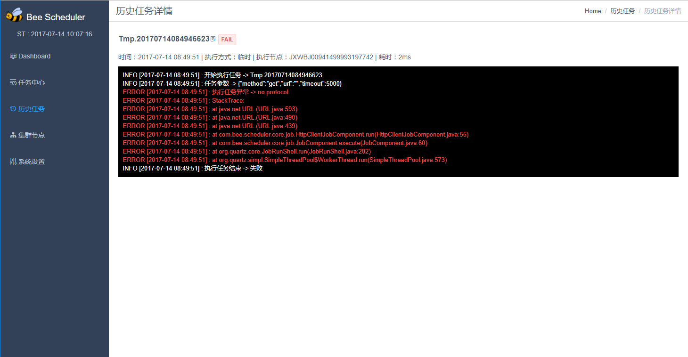
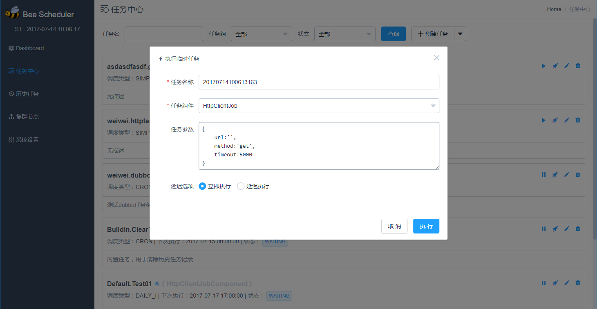

#Bee-Scheduler
>这次，造了一个不太一样的轮子。。。
  
##特性
- 基于Quartz-2.3.0开发，支持集群和单机两种运行模式（集群模式基于Quartz内置特性实现，原理是db锁做任务状态同步）
- 通过任务组件的方式，将调度逻辑与任务逻辑完全隔离，代码零侵入，灵活性极高
- 支持多种调度触发器（simple、calendar、daily、cron）
- 任务管理（暂停、恢复调度、删除等等）
- 支持联动任务，直接页面操作来配置出任何你想要的联动规则
- 详细的任务历史记录（执行时间、执行节点、耗时、日志、状态、执行方式等等。。。）
- 支持临时任务
  
> 该项目目前处于初期，核心功能已经完成，其他更多特性正在码代码。。。请看todo list
  
##运行前准备
- JAVA 1.7+
- Mysql
  
##开始
创建一个数据库用于存储任务数据（库名随意、UTF-8字符集），比如下文中的bee-scheduler就是库名  
至此，所有准备工作就已经完成！  
  
>“不用建表吗（黑人问号脸.jpg）？？？”  
>“不用！数据表会在系统首次启动的时候自动生成”
  
##单机运行模式:
```shell
java -jar admin-node-xxx.jar --server.port=8080 --dburl="127.0.0.1:3306/bee-scheduler?user=root&password=root&characterEncoding=UTF-8&useSSL=false"
```
可以使用 ```--thread-pool-size=30``` 来设置调度线程池大小  
启动完成后浏览器访问：http://ip:port  ，请使用IE9+、Chrome、Safari、Firefox等现代浏览器  
  
##集群运行模式：
###1、运行一个管理节点（使用--cluster开启集群）：
```shell
java -jar admin-node-xxx.jar --server.port=8080 --dburl="127.0.0.1:3306/bee-scheduler?user=root&password=root&characterEncoding=UTF-8&useSSL=false" --cluster
```
可以使用 ```--thread-pool-size=30``` 来设置调度线程池大小  
启动完成后浏览器访问管理节点：http://ip:port **（注意：管理节点自身也是一个普通的调度节点）**，请使用IE9+、Chrome、Safari、Firefox等现代浏览器 
###2、使用runnable-node扩展节点
```shell
java -jar runnable-node-xxx.jar --dburl="127.0.0.1:3306/bee-scheduler?user=root&password=root&characterEncoding=UTF-8&useSSL=false"
```
可以使用 ```--thread-pool-size=30``` 来设置调度线程池大小  
启动完成后，会自动加入集群（基于db做注册），访问管理节点能看到集群信息

##管理界面截图






  
##Todo List
- 添加报警机制，任务执行失败时邮件报警
- 完善Dashboard，完善各种统计、监控信息
- 支持Oracle数据库
- 增加更多任务组件
- 增加权限管理
- 实时日志
- 更多....
  
##开源协议
[MIT](http://opensource.org/licenses/MIT)